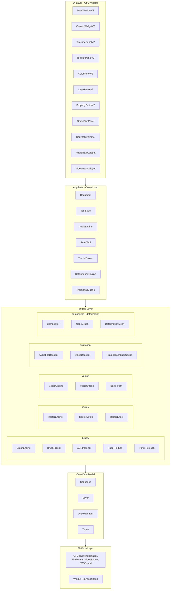
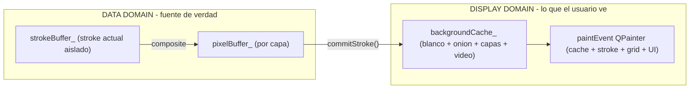
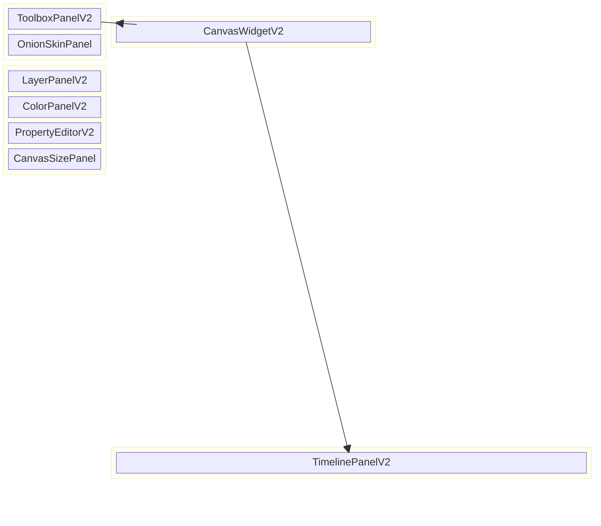

# Free Animation Power

Software de animacion 2D profesional — Motor hibrido vector + raster. Construido con C++20 y Qt 6.

## Descripcion

Free Animation Power combina animacion cuadro-por-cuadro tradicional (estilo TVPaint) con capacidades vectoriales modernas en una sola aplicacion. Cada trazo puede renderizarse como pixeles (raster), como path vectorial, o como ambos simultaneamente.

---

## Arquitectura



### Jerarquia de Capas

- **RasterLayer** — Buffer de pixeles ARGB32 con COW, origen variable, flag `hasContent_`
- **VectorLayer** — Coleccion de `VectorStroke` con `BezierPath`
- **GroupLayer** — Compuesto recursivo con blend modes y opacidad
- **AudioLayer** — Datos de audio (modelo, no subclase de Layer)
- **CameraLayer** — Transformaciones de camara

### Pipeline de Renderizado (4-Buffer CPU)



### Formato de Archivo (.fap v2)

- `manifest.json` — version, canvas, secuencias activas, viewport, markers
- `timeline.json` — frames, capas, audio, video por secuencia
- `audio/track_N.ext` — archivos de audio incrustados
- `video/track_N.ext` — archivos de video incrustados
- `layers/S{seq}/frame_{f}/layer_{ll}.png` + `.json` — pixeles + metadata

**Caracteristicas**: save atomico (.tmp → rename), deduplicacion de pixeles, audio/video embedding, backward compatible con v1/v2/v3 legacy.

---

## Multi-Sequencia

Cada documento puede contener multiples secuencias independientes (como tracks en Premiere):

- **Sequence 0** (track superior / visual top)
  - frames (mapa sparse: frame → GroupLayer)
  - keyframes [layer][frame]
  - UndoManager (100 entradas, aislado por secuencia)
  - playback state (currentFrame, fps, looping, playing)
  - Work Area (in/out points) + Duration
  - Markers estilo After Effects
  - Line Boil (efecto linea vibrante no destructivo)
- **Sequence 1** ...
- **Sequence N** (track inferior / fondo visual)

Cada secuencia tiene su propia pila undo, FPS, opacidad y bloqueo. Las secuencias se componen en orden (0 = top, N = fondo).

---

## UI Layout



| Dock | Posicion | Contenido |
|------|----------|-----------|
| **TOOLS** | Left | 17 botones de herramienta (36px icons) |
| **ONION SKIN** | Left | Checkbox enabled, spinners prev/next, slider opacidad |
| **CANVAS** | Center | Pipeline 4-buffer, 17 herramientas, tablet support |
| **LAYERS** | Right | Lista de capas, visibilidad, blend mode, opacidad, bloqueo |
| **COLOR** | Right | QColorDialog + 9 circulos MRU |
| **PROPERTIES** | Right | Editor contextual: brush, texto, color, fill, line |
| **CANVAS SIZE** | Right | Width x Height + Apply |
| **TIMELINE** | Bottom | Multi-secuencia, frames, audio, video, markers, WA, FPS |

### Timeline Layout

```
Transport Bar:  [Play] [Stop] [Prev] [Next]  FPS [24]  [+ Track]
Ruler Widget:  ticks de frame + Work Area naranja + markers + playhead
QScrollArea:
  ├── SequenceTrackWidget[]  (nombre, opacidad, lock, celdas, line boil)
  ├── AudioTrackWidget[]     (waveform, mute, volumen, libre movimiento)
  ├── VideoTrackWidget[]     (thumbnails, opacidad, volumen)
  └── Stretch spacer
Horizontal ScrollBar:  scroll sincronizado entre tracks y ruler
```

---

## Herramientas

| ToolType | Descripcion |
|----------|-------------|
| **Brush** | Dibujo con presion, estabilizador, punta configurable |
| **Eraser** | Borrado con modo DestinationOut |
| **ColorPicker** | Cuentagotas con lupa de preview |
| **Fill** | Relleno con tolerancia (Solid, Fabric, Ramp) |
| **Text** | Texto multi-linea con fuente, leading, tracking, anti-aliasing |
| **Line** | Linea recta con snapping y estilos |
| **Rectangle** | Rectangulo relleno/borde |
| **Ellipse** | Elipse relleno/borde |
| **Move** | Desplazamiento de capa con buffer expansion |
| **Select** | Seleccion rectangular con copy/cut/paste/delete |
| **Hand** | Pan de canvas (middle-click + drag) |
| **PencilRetouch** | Retoque de grosor de trazos |
| **RulerLine** | Regla lineal con snapping |
| **RulerEllipse** | Regla eliptica con snapping |
| **DeformMesh** | Malla de deformacion bilineal |
| **TweenEdit** | Edicion de interpolacion de keyframes |

**Tableta grafica**: Wacom, Huion, Xencelabs, XP-Pen. Presion modula tamano y opacidad. Deteccion automatica de borrador.

---

## Estado Actual (v1.0.0)

### Lo que funciona

- 17 herramientas de dibujo con pipeline 4-buffer CPU
- Pinceles con presion, estabilizador, textura de papel, import ABR
- Timeline multi-secuencia con Work Area, marcadores, Line Boil, ocultacion no destructiva (+/-)
- Capas raster + vectoriales + grupo con 12 blend modes
- Audio tracks: import WAV/MP3/FLAC, waveform visual, playback sincronizado
- Video tracks: import MP4/MOV/WebM, thumbnails, cache LRU 50 frames, composicion sobre dibujo
- Onion skinning con frames previos/siguientes y opacidad configurable
- Undo/Redo por secuencia (profundidad 100, comandos compuestos)
- 8 docks desacoplables con tema oscuro (#252830 / #FF4800)
- Formato .fap v2 (ZIP binario, save atomico, audio/video embedding)
- Export: MP4 H.264, MOV QuickTime Alpha, WebM VP9 Alpha, GIF, SVG, PNG sequence
- File association en Windows (.fap registry + icono en EXE)
- 160 tests unitarios, todos pasando

### Numeros

| Metrica | Valor |
|---------|-------|
| Archivos fuente | 98 .hpp/.cpp/.h |
| Tests | 160 |
| Herramientas | 17 |
| Docks | 8 |
| Blend modes | 12 |
| Formatos audio | WAV, MP3, FLAC (dr_libs) |
| Formatos export | MP4, MOV, WebM, GIF, PNG seq, SVG |

---

## Build & Run

```powershell
cmake -B build -DCMAKE_BUILD_TYPE=Release
cmake --build build --config Release
.\build\Release\free-animation-power.exe
```

### Tests

```powershell
ctest --test-dir build
```

### Requisitos

- CMake 3.20+
- Qt 6.5+ (Core, Gui, Widgets, Multimedia, Svg)
- FFmpeg (externo, para video/audio decode y export)
- C++20 compiler (MSVC 2022+, GCC 11+, Clang 14+)
- GoogleTest 1.14.0 (FetchContent automatico)

### Stack

| Componente | Tecnologia |
|-----------|-----------|
| Lenguaje | C++20 |
| UI | Qt 6.5+ Widgets |
| Build | CMake 3.20+ |
| Tests | GoogleTest |
| Compresion | miniz 3.0.2 (zlib) |
| Audio decode | dr_wav, dr_mp3, dr_flac |
| Video export | FFmpeg (subprocess) |

---

## Documentacion

- `docs/INFORME_ARQUITECTURA_V1.md` — Informe completo de arquitectura (espanol)
- `docs/architecture.md` — Documento formal de arquitectura (ingles)
- `docs/build-instructions.md` — Instrucciones de compilacion
- `AGENTS.md` — Referencia tecnica para agentes AI
- `CHANGELOG.md` — Historial de versiones
- `CONTEXT.md` — Glosario de dominio

---

## Autor

**Eduardo Fierro Duque**

- Web: [www.fierroduque.com](https://www.fierroduque.com)
- LinkedIn: [linkedin.com/in/eduardofierroduque](https://www.linkedin.com/in/eduardofierroduque/)

## Licencia

GNU General Public License v3.0 (GPLv3). Ver [LICENSE](LICENSE).
