# Free Animation Power

<p align="center">
  <a href="https://freeanimationpower.org"></a>
  <a href="https://www.youtube.com/@freeanimationpower"></a>
  <a href="https://github.com/freeanimationpower"></a>
</p>

<p align="center">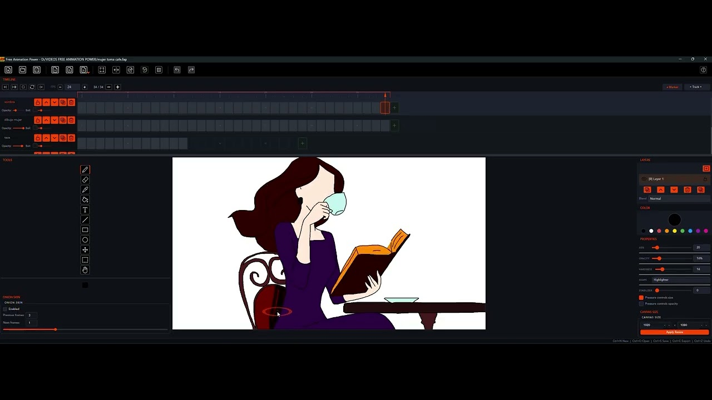</p>

**Free Animation Power** es un ecosistema completo de herramientas gratuitas para **animación 2D, ilustración, motion graphics y escritura audiovisual** — en su mayoría 100% cliente, sin instalación y sin subir tus archivos a ningún servidor. Creado por [Eduardo Fierro Duque](https://www.fierroduque.com).

Todo el ecosistema en vivo: **[freeanimationpower.org](https://freeanimationpower.org)**

---

## 🧰 Las 11 herramientas del ecosistema

### Desktop App (Windows)

<p align="center"><a href="https://github.com/freeanimationpower/FreeAnimationPower"></a></p>

Estudio de animación 2D profesional nativo para Windows. Motor híbrido vector + raster, C++20 y Qt 6. 17 herramientas, multi-secuencia, audio/vídeo, 12 modos de fusión, exportación MP4/WebM/GIF/SVG.

- 🔗 Repo: [freeanimationpower/FreeAnimationPower](https://github.com/freeanimationpower/FreeAnimationPower)
- 🌐 En vivo: [freeanimationpower.org](https://freeanimationpower.org/tools/desktop/)

### Desktop Web

<p align="center"><a href="https://github.com/freeanimationpower/FAP_PC_WEB_VERSION">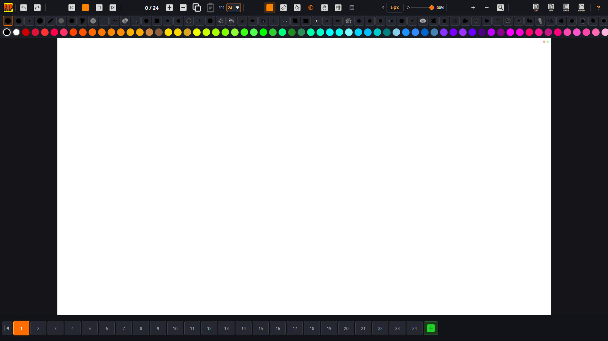</a></p>

Estudio de animación 2D para PC en el navegador. Lienzo 1920×1080, soporte de tableta gráfica, 60 pinceles, onion skin, exporta GIF y vídeo. Cero dependencias.

- 🔗 Repo: [freeanimationpower/FAP_PC_WEB_VERSIÓN](https://github.com/freeanimationpower/FAP_PC_WEB_VERSION)
- 🌐 En vivo: [freeanimationpower.org](https://freeanimationpower.org/tools/pc-web/)

### Mobile Web / PWA

<p align="center"><a href="https://github.com/freeanimationpower/FAP_MOBILE_WEB_VERSION">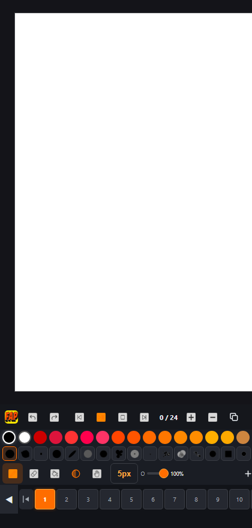</a></p>

Estudio de animación 2D para móviles. 60 pinceles, onion skin, 66 colores, exportación GIF/vídeo, archivos .fap. 100% cliente.

- 🔗 Repo: [freeanimationpower/FAP_MOBILE_WEB_VERSIÓN](https://github.com/freeanimationpower/FAP_MOBILE_WEB_VERSION)
- 🌐 En vivo: [freeanimationpower.org](https://freeanimationpower.org/tools/mobile/)

### Free Text Motion

<p align="center"><a href="https://github.com/freeanimationpower/FREE-ANIMATION-POWER_TEXT-MOTION-CONTROL"></a></p>

Estudio de texto animado con 205 presets de motion graphics. Exporta WebM/MP4/GIF con canal alfa.

- 🔗 Repo: [freeanimationpower/FREE-ANIMATION-POWER_TEXT-MOTION-CONTROL](https://github.com/freeanimationpower/FREE-ANIMATION-POWER_TEXT-MOTION-CONTROL)
- 🌐 En vivo: [freeanimationpower.org](https://freeanimationpower.org/tools/text-motion/)

### Free Particle FX

<p align="center"><a href="https://github.com/freeanimationpower/FREE-PARTICLE-FX"></a></p>

Sistema de partículas con 54 presets en 7 familias: humo, fuego, nieve, confeti, galaxias y píxel FX estilo DOOM. Exporta con transparencia.

- 🔗 Repo: [freeanimationpower/FREE-PARTICLE-FX](https://github.com/freeanimationpower/FREE-PARTICLE-FX)
- 🌐 En vivo: [freeanimationpower.org](https://freeanimationpower.org/tools/particle-fx/)

### Free Illustration Power

<p align="center"><a href="https://github.com/freeanimationpower/Free-Illustration-Power">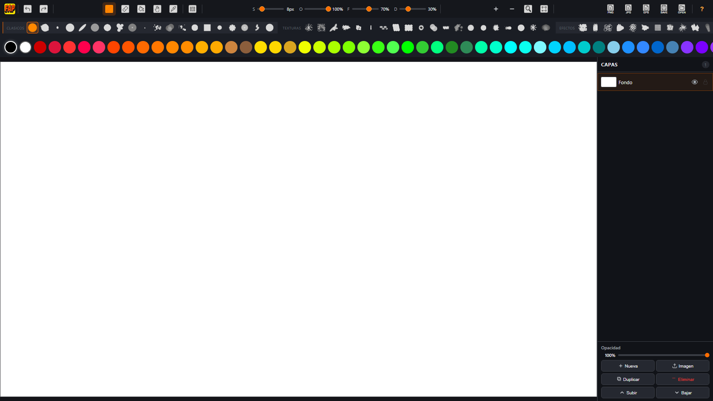</a></p>

Editor de ilustración digital con capas y pinceles profesionales, 100% en el navegador.

- 🔗 Repo: [freeanimationpower/Free-Illustration-Power](https://github.com/freeanimationpower/Free-Illustration-Power)
- 🌐 En vivo: [freeanimationpower.org](https://freeanimationpower.org/tools/illustration/)

### Free Vector Image

<p align="center"><a href="https://github.com/freeanimationpower/free-vector-image">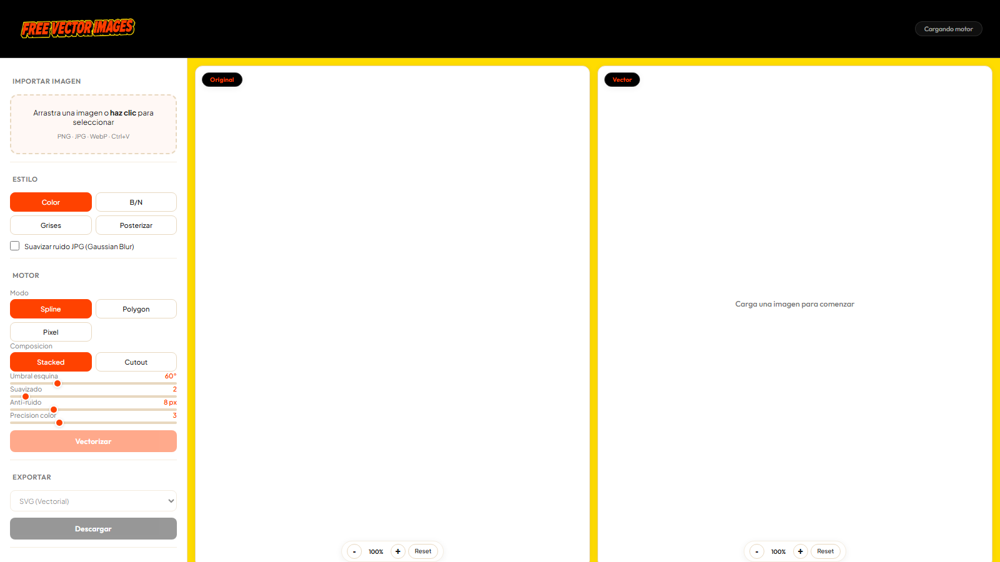</a></p>

Convierte bocetos, logos e ilustraciones en vectores escalables al infinito. Sin instalar nada, sin subir archivos a servidores.

- 🔗 Repo: [freeanimationpower/free-vector-image](https://github.com/freeanimationpower/free-vector-image)
- 🌐 En vivo: [freeanimationpower.org](https://freeanimationpower.org/tools/vector/)

### Transformador GIF / SVG Online

<p align="center"><a href="https://github.com/freeanimationpower/FAP_GIF_SVG_TRANSFORM">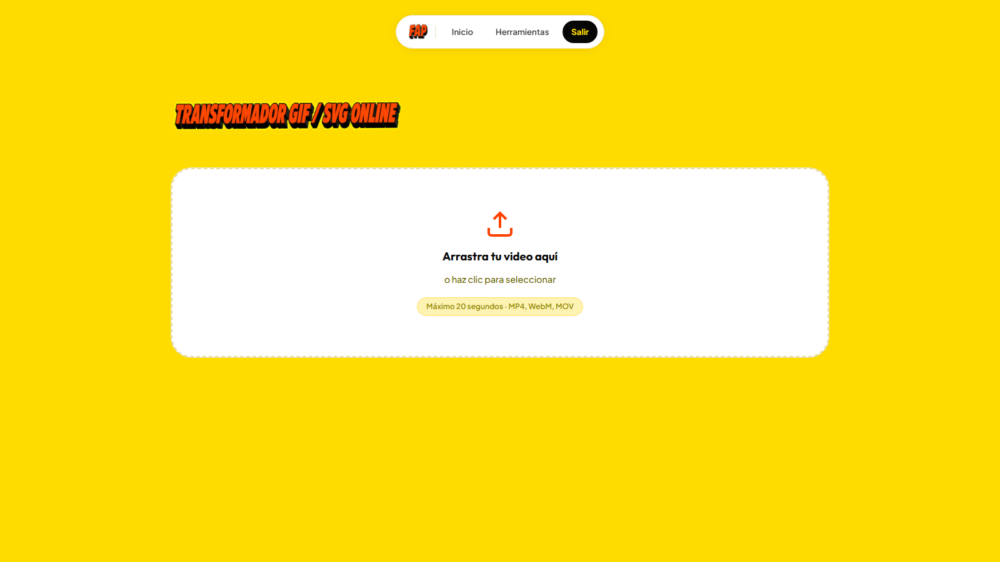</a></p>

Convierte vídeos cortos a GIF animado o SVG animado. React 19 + TypeScript + Vite, 100% cliente.

- 🔗 Repo: [freeanimationpower/FAP_GIF_SVG_TRANSFORM](https://github.com/freeanimationpower/FAP_GIF_SVG_TRANSFORM)
- 🌐 En vivo: [freeanimationpower.org](https://freeanimationpower.org/tools/gif-maker/)

### Free Animation Glitch

<p align="center"><a href="https://github.com/freeanimationpower/FREE-ANIMATION-GLITCH">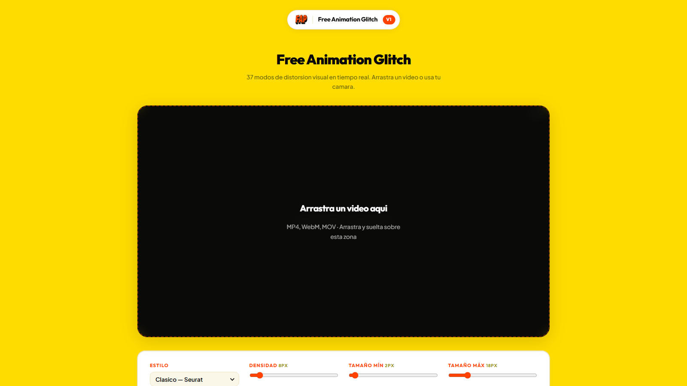</a></p>

37 modos de distorsión visual en tiempo real. Arrastra un vídeo o usa tu cámara.

- 🔗 Repo: [freeanimationpower/FREE-ANIMATION-GLITCH](https://github.com/freeanimationpower/FREE-ANIMATION-GLITCH)
- 🌐 En vivo: [freeanimationpower.org](https://freeanimationpower.org/tools/glitch/)

### Storyboard AI

<p align="center"><a href="https://github.com/freeanimationpower/FAP_AI_STORYBOARD_WEB">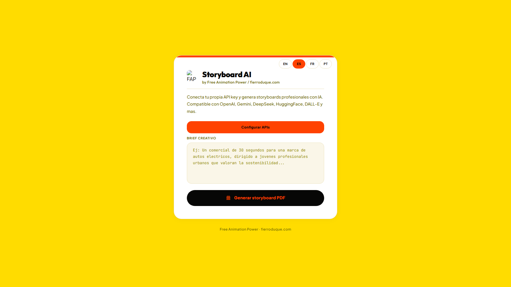</a></p>

Generador de storyboards con IA multi-proveedor (OpenAI, Gemini, DeepSeek, HuggingFace, DALL-E). Exporta a PDF.

- 🔗 Repo: [freeanimationpower/FAP_AI_STORYBOARD_WEB](https://github.com/freeanimationpower/FAP_AI_STORYBOARD_WEB)
- 🌐 En vivo: [freeanimationpower.org](https://freeanimationpower.org/tools/storyboard/)

### Free Script Power

<p align="center"><a href="https://github.com/freeanimationpower/FREE-SCRIPT-POWER">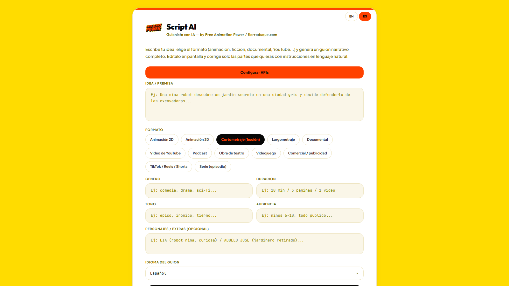</a></p>

Generador de guiones con IA: 12 formatos profesionales (cine, YouTube, podcast, publicidad, series y más).

- 🔗 Repo: [freeanimationpower/FREE-SCRIPT-POWER](https://github.com/freeanimationpower/FREE-SCRIPT-POWER)
- 🌐 En vivo: [freeanimationpower.org](https://freeanimationpower.org/tools/script/)

---


---

<p align="center">
  <a href="https://freeanimationpower.org"></a>
  <a href="https://www.youtube.com/@freeanimationpower"></a>
  <a href="https://github.com/freeanimationpower"></a>
</p>

<p align="center">
  <a href="https://youtu.be/_s8zxOe5YUk"></a>
</p>

## 🎬 Vídeos

📺 Canal oficial: [@freeanimationpower](https://www.youtube.com/@freeanimationpower)

| Vídeo | Título |
|---|---|
| <a href="https://youtu.be/_s8zxOe5YUk"></a> | [Prueba de estrés N5 — 7 meses de desarrollo, 1 mes sin bugs](https://youtu.be/_s8zxOe5YUk) |
| <a href="https://youtu.be/Xe-5OqXhCVU"></a> | [El motor C++20, la cadena de 4 buffers y la exportación profesional](https://youtu.be/Xe-5OqXhCVU) |
| <a href="https://youtu.be/X4bPLlr07nQ"></a> | [Así funciona el sistema de capas, secuencias y onion skin](https://youtu.be/X4bPLlr07nQ) |
| <a href="https://youtu.be/RUCeO4JHHtk"></a> | [Onion Skin y tiempos distintos dentro del mismo segundaje](https://youtu.be/RUCeO4JHHtk) |
| <a href="https://youtu.be/FoRy9u4NZ0A"></a> | [Los 12 modos de fusión explicados con linternas](https://youtu.be/FoRy9u4NZ0A) |
| <a href="https://youtu.be/GbQypO28FkA"></a> | [Separa tus secuencias, renombra todo y haz vibrar tus dibujos (Line Boil)](https://youtu.be/GbQypO28FkA) |
| <a href="https://youtu.be/mkac7WQXX7U"></a> | [Cómo funcionan las secuencias, layers, colores y la exportación](https://youtu.be/mkac7WQXX7U) |
| <a href="https://youtu.be/4-MJtsg9hvg"></a> | [Cómo instalar en Windows: el mensaje de SmartScreen y por qué viene limpio](https://youtu.be/4-MJtsg9hvg) |

---

## 🖥️ Documentación técnica — Free Animation Power Desktop App

## Descripción

Free Animation Power combina animación cuadro-por-cuadro tradicional (estilo TVPaint) con capacidades vectoriales modernas en una sola aplicación. Cada trazo puede renderizarse como píxeles (raster), como path vectorial, o como ambos simultaneamente.

---

## Arquitectura

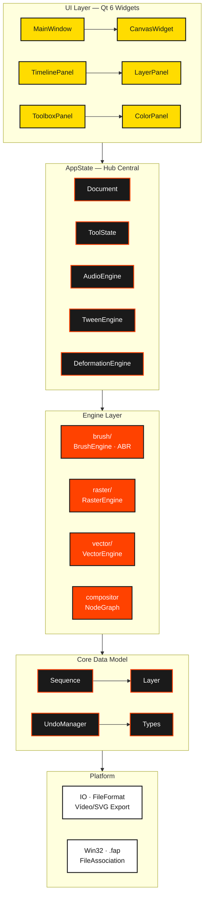
```mermaid
flowchart TB
    classDef ui fill:#ffdc00,stroke:#1a1a1a,color:#1a1a1a,stroke-width:2px;
    classDef engine fill:#ff4200,stroke:#1a1a1a,color:#ffffff,stroke-width:2px;
    classDef data fill:#1a1a1a,stroke:#ff4200,color:#ffffff,stroke-width:2px;
    classDef ext fill:#ffffff,stroke:#1a1a1a,color:#1a1a1a,stroke-width:2px;
        subgraph UI["UI Layer — Qt 6 Widgets"]
            direction LR
            MW["MainWindow"] --> CW["CanvasWidget"]
            TP["TimelinePanel"] --> LP["LayerPanel"]
            TB["ToolboxPanel"] --> CP["ColorPanel"]
        end
        subgraph APP["AppState — Hub Central"]
            DOC["Document"]
            TST["ToolState"]
            AUD["AudioEngine"]
            TWN["TweenEngine"]
            DEF["DeformationEngine"]
        end
        subgraph ENG["Engine Layer"]
            direction LR
            BRS["brush/<br/>BrushEngine · ABR"]
            RST["raster/<br/>RasterEngine"]
            VCT["vector/<br/>VectorEngine"]
            CMP["compositor<br/>NodeGraph"]
        end
        subgraph CORE["Core Data Model"]
            direction LR
            SEQ["Sequence"] --> LYR["Layer"]
            UND["UndoManager"] --> TYP["Types"]
        end
        subgraph PLT["Platform"]
            IO["IO · FileFormat<br/>Vídeo/SVG Export"]
            WIN["Win32 · .fap<br/>FileAssociation"]
        end
        UI --> APP
        APP --> ENG
        ENG --> CORE
        CORE --> PLT
        class MW,CW,TP,LP,TB,CP ui
        class DOC,TST,AUD,TWN,DEF data
        class BRS,RST,VCT,CMP engine
        class SEQ,LYR,UND,TYP data
        class IO,WIN ext
```

### Jerarquia de Capas

- **RasterLayer** — Buffer de píxeles ARGB32 con COW, origen variable, flag `hasContent_`
- **VectorLayer** — Coleccion de `VectorStroke` con `BezierPath`
- **GroupLayer** — Compuesto recursivo con blend modes y opacidad
- **AudioLayer** — Datos de audio (modelo, no subclase de Layer)
- **CameraLayer** — Transformaciones de cámara

### Pipeline de Renderizado (4-Buffer CPU)

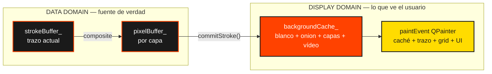
```mermaid
flowchart LR
    classDef ui fill:#ffdc00,stroke:#1a1a1a,color:#1a1a1a,stroke-width:2px;
    classDef engine fill:#ff4200,stroke:#1a1a1a,color:#ffffff,stroke-width:2px;
    classDef data fill:#1a1a1a,stroke:#ff4200,color:#ffffff,stroke-width:2px;
    classDef ext fill:#ffffff,stroke:#1a1a1a,color:#1a1a1a,stroke-width:2px;
        subgraph DATA["DATA DOMAIN — fuente de verdad"]
            direction TB
            PX["pixelBuffer_<br/>por capa"]
            ST["strokeBuffer_<br/>trazo actual"]
        end
        subgraph DISP["DISPLAY DOMAIN — lo que ve el usuario"]
            direction TB
            BG["backgroundCache_<br/>blanco + onion + capas + vídeo"]
            PA["paintEvent QPainter<br/>caché + trazo + grid + UI"]
        end
        ST -- "composite" --> PX
        PX -- "commitStroke()" --> BG
        BG --> PA
        class PX,ST data
        class BG engine
        class PA ui
```

### Formato de Archivo (.fap v2)

- `manifest.json` — versión, canvas, secuencias activas, viewport, markers
- `timeline.json` — frames, capas, audio, vídeo por secuencia
- `audio/track_N.ext` — archivos de audio incrustados
- `video/track_N.ext` — archivos de vídeo incrustados
- `layers/S{seq}/frame_{f}/layer_{ll}.png` + `.json` — píxeles + metadata

**Características**: save atomico (.tmp → rename), deduplicacion de píxeles, audio/vídeo embedding, backward compatible con v1/v2/v3 legacy.

---

## Multi-Sequencia

Cada documento puede contener multiples secuencias independientes (como tracks en Premiere):

- **Sequence 0** (track superior / visual top)
  - frames (mapa sparse: frame → GroupLayer)
  - keyframes [layer][frame]
  - UndoManager (100 entradas, aislado por secuencia)
  - playback state (currentFrame, fps, looping, playing)
  - Work Area (in/out points) + Duration
  - Markers estilo After Effects
  - Line Boil (efecto linea vibrante no destructivo)
- **Sequence 1** ...
- **Sequence N** (track inferior / fondo visual)

Cada secuencia tiene su propia pila undo, FPS, opacidad y bloqueo. Las secuencias se componen en orden (0 = top, N = fondo).

---

## UI Layout

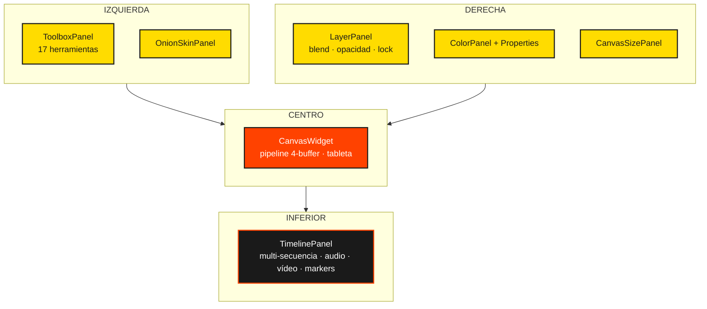
```mermaid
flowchart TB
    classDef ui fill:#ffdc00,stroke:#1a1a1a,color:#1a1a1a,stroke-width:2px;
    classDef engine fill:#ff4200,stroke:#1a1a1a,color:#ffffff,stroke-width:2px;
    classDef data fill:#1a1a1a,stroke:#ff4200,color:#ffffff,stroke-width:2px;
    classDef ext fill:#ffffff,stroke:#1a1a1a,color:#1a1a1a,stroke-width:2px;
        subgraph LEFT["IZQUIERDA"]
            direction TB
            TL["ToolboxPanel<br/>17 herramientas"]
            OS["OnionSkinPanel"]
        end
        subgraph CENTER["CENTRO"]
            CV["CanvasWidget<br/>pipeline 4-buffer · tableta"]
        end
        subgraph RIGHT["DERECHA"]
            direction TB
            LY["LayerPanel<br/>blend · opacidad · lock"]
            CL["ColorPanel + Properties"]
            CS["CanvasSizePanel"]
        end
        subgraph BOTTOM["INFERIOR"]
            TM["TimelinePanel<br/>multi-secuencia · audio · vídeo · markers"]
        end
        LEFT --> CENTER
        RIGHT --> CENTER
        CENTER --> BOTTOM
        class TL,OS,LY,CL,CS ui
        class CV engine
        class TM data
```

| Dock | Posición | Contenido |
|------|----------|-----------|
| **TOOLS** | Left | 17 botones de herramienta (36px icons) |
| **ONION SKIN** | Left | Checkbox enabled, spinners prev/next, slider opacidad |
| **CANVAS** | Center | Pipeline 4-buffer, 17 herramientas, tablet support |
| **LAYERS** | Right | Lista de capas, visibilidad, blend mode, opacidad, bloqueo |
| **COLOR** | Right | QColorDialog + 9 circulos MRU |
| **PROPERTIES** | Right | Editor contextual: brush, texto, color, fill, line |
| **CANVAS SIZE** | Right | Width x Height + Apply |
| **TIMELINE** | Bottom | Multi-secuencia, frames, audio, vídeo, markers, WA, FPS |

### Timeline Layout

```
Transport Bar:  [Play] [Stop] [Prev] [Next]  FPS [24]  [+ Track]
Ruler Widget:  ticks de frame + Work Area naranja + markers + playhead
QScrollArea:
  ├── SequenceTrackWidget[]  (nombre, opacidad, lock, celdas, line boil)
  ├── AudioTrackWidget[]     (waveform, mute, volumen, libre movimiento)
  ├── VideoTrackWidget[]     (thumbnails, opacidad, volumen)
  └── Stretch spacer
Horizontal ScrollBar:  scroll sincronizado entre tracks y ruler
```

---

## Herramientas

| ToolType | Descripción |
|----------|-------------|
| **Brush** | Dibujo con presión, estabilizador, punta configurable |
| **Eraser** | Borrado con modo DestinationOut |
| **ColorPicker** | Cuentagotas con lupa de preview |
| **Fill** | Relleno con tolerancia (Solid, Fabric, Ramp) |
| **Text** | Texto multi-linea con fuente, leading, tracking, anti-aliasing |
| **Line** | Linea recta con snapping y estilos |
| **Rectangle** | Rectangulo relleno/borde |
| **Ellipse** | Elipse relleno/borde |
| **Move** | Desplazamiento de capa con buffer expansion |
| **Select** | Selección rectangular con copy/cut/paste/delete |
| **Hand** | Pan de canvas (middle-click + drag) |
| **PencilRetouch** | Retoque de grosor de trazos |
| **RulerLine** | Regla lineal con snapping |
| **RulerEllipse** | Regla eliptica con snapping |
| **DeformMesh** | Malla de deformacion bilineal |
| **TweenEdit** | Edición de interpolación de keyframes |

**Tableta gráfica**: Wacom, Huion, Xencelabs, XP-Pen. Presión modula tamano y opacidad. Deteccion automática de borrador.

---

## Estado Actual (v1.0.0)

### Lo que funciona

- 17 herramientas de dibujo con pipeline 4-buffer CPU
- Pinceles con presión, estabilizador, textura de papel, import ABR
- Timeline multi-secuencia con Work Area, marcadores, Line Boil, ocultacion no destructiva (+/-)
- Capas raster + vectoriales + grupo con 12 blend modes
- Audio tracks: import WAV/MP3/FLAC, waveform visual, playback sincronizado
- Vídeo tracks: import MP4/MOV/WebM, thumbnails, cache LRU 50 frames, composición sobre dibujo
- Onion skinning con frames previos/siguientes y opacidad configurable
- Undo/Redo por secuencia (profundidad 100, comandos compuestos)
- 8 docks desacoplables con tema oscuro (#252830 / #FF4800)
- Formato .fap v2 (ZIP binario, save atomico, audio/vídeo embedding)
- Export: MP4 H.264, MOV QuickTime Alpha, WebM VP9 Alpha, GIF, SVG, PNG sequence
- File association en Windows (.fap registry + icono en EXE)
- 160 tests unitarios, todos pasando

### Números

| Métrica | Valor |
|---------|-------|
| Archivos fuente | 98 .hpp/.cpp/.h |
| Tests | 160 |
| Herramientas | 17 |
| Docks | 8 |
| Blend modes | 12 |
| Formatos audio | WAV, MP3, FLAC (dr_libs) |
| Formatos export | MP4, MOV, WebM, GIF, PNG seq, SVG |

---

## Build & Run

```powershell
cmake -B build -DCMAKE_BUILD_TYPE=Release
cmake --build build --config Release
.\build\Release\free-animation-power.exe
```

### Tests

```powershell
ctest --test-dir build
```

### Requisitos

- CMake 3.20+
- Qt 6.5+ (Core, Gui, Widgets, Multimedia, Svg)
- FFmpeg (externo, para vídeo/audio decode y export)
- C++20 compiler (MSVC 2022+, GCC 11+, Clang 14+)
- GoogleTest 1.14.0 (FetchContent automático)

### Stack

| Componente | Tecnologia |
|-----------|-----------|
| Lenguaje | C++20 |
| UI | Qt 6.5+ Widgets |
| Build | CMake 3.20+ |
| Tests | GoogleTest |
| Compresion | miniz 3.0.2 (zlib) |
| Audio decode | dr_wav, dr_mp3, dr_flac |
| Vídeo export | FFmpeg (subprocess) |

---

## Documentacion

- **Informe Técnico Completo**: [INFORME_TÉCNICO_FREE ANIMATION POWER EXE.pdf](informes_pdf/INFORME_TÉCNICO_FREE%20ANIMATION%20POWER%20EXE.pdf) — Documento completo de arquitectura C++20/Qt 6, pipeline de renderizado, sistema de herramientas y especificaciones técnicas.
- `docs/INFORME_ARQUITECTURA_V1.md` — Informe completo de arquitectura (espanol)
- `docs/architecture.md` — Documento formal de arquitectura (ingles)
- `docs/build-instructions.md` — Instrucciones de compilación
- `AGENTS.md` — Referencia técnica para agentes AI
- `CHANGELOG.md` — Historial de versiones
- `CONTEXT.md` — Glosario de dominio

  https://youtu.be/FoRy9u4NZ0A?si=sCCUlMUCn-oHfqwT
  https://youtu.be/Xe-5OqXhCVU?si=ctjyuEl5iTDWuYDj
  https://youtu.be/mkac7WQXX7U?si=ZQMydQTFvAdiN1YY
  https://youtu.be/4-MJtsg9hvg?si=Iml6FL4e8angHKTM

---

## 👤 Autor

**Eduardo Fierro Duque**

- Web: [www.fierroduque.com](https://www.fierroduque.com)
- LinkedIn: [linkedin.com/in/eduardofierroduque](https://www.linkedin.com/in/eduardofierroduque)
- YouTube: [@freeanimationpower](https://www.youtube.com/@freeanimationpower)
- GitHub: [freeanimationpower](https://github.com/freeanimationpower) · [eduardofierroduque-sudo](https://github.com/eduardofierroduque-sudo)

## 📄 Licencia

GNU General Public License v3.0 (GPLv3). Ver [LICENSE](LICENSE).
